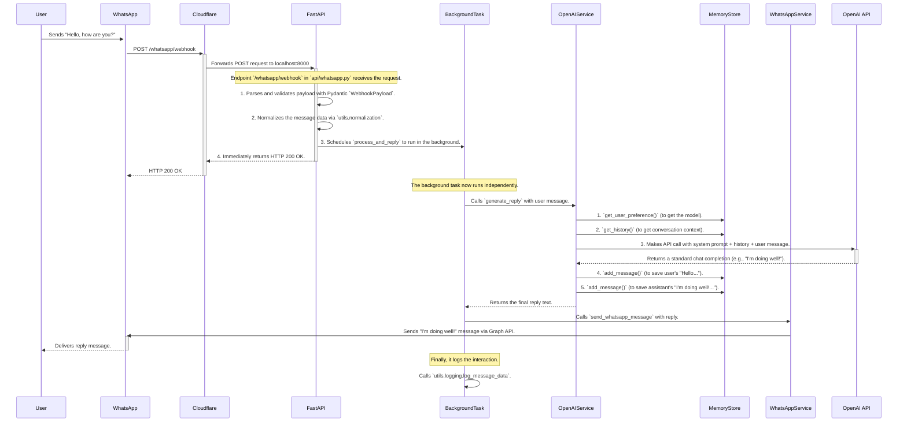
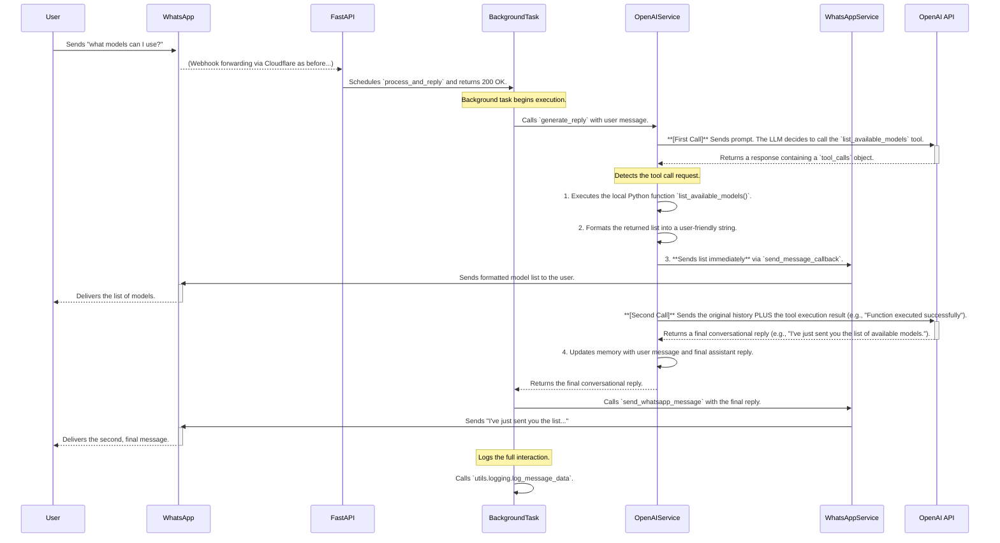

# Project Architecture and Execution Flow

This document provides a detailed look at the project's structure and the step-by-step execution flow for handling incoming WhatsApp messages.

---

## 1. Project Structure

The project follows a standard FastAPI layout, separating concerns into distinct modules for clarity and maintainability.

```plaintext
whatsapp-fastapi-agent/
├── .cloudflared/      # (Local) Cloudflare Tunnel configuration.
├── api/               # FastAPI routers and dependencies.
├── core/              # Core application settings and configuration.
├── documentation/     # Guides for setup, integration, and architecture.
├── models/            # Pydantic models for data validation.
├── services/          # Business logic (OpenAI, WhatsApp, Memory).
├── utils/             # Helper utilities (logging, normalization).
├── .env.example       # Environment variable template.
├── environment.yml    # Conda environment definition.
├── main.py            # Main FastAPI application entry point.
└── README.md          # Project overview and setup instructions.
```

---

## 2. Execution Flow

The application processes messages in the background to ensure the webhook responds to Meta's servers immediately. There are two primary flows depending on whether the LLM decides to use a tool.

### Flow A: Standard Chat Reply (No Tool Use)

This is the most common path, where a user sends a message and receives a direct conversational reply.



### Flow B: Chat Reply with Tool Use (e.g., "what models can I use?")

This flow is triggered when the user's query causes the LLM to call the `list_available_models` tool. It involves two API calls to OpenAI.


